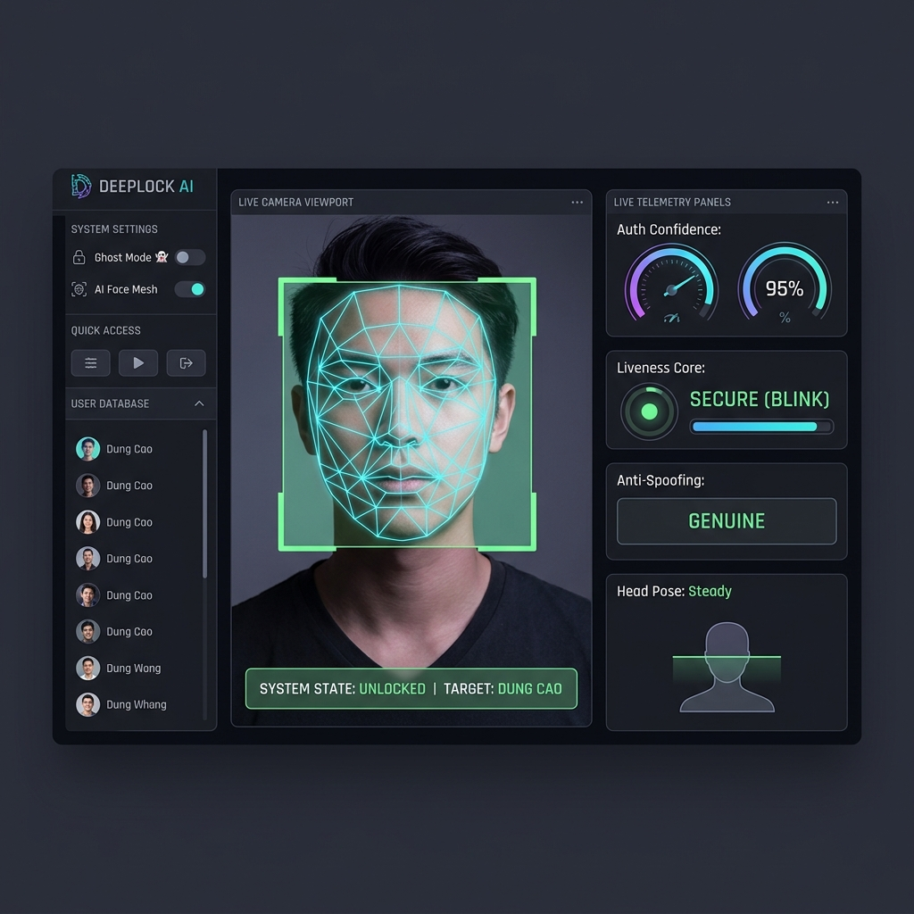

# 🔐 DeepLock Pro - Advanced Biometric Face Authentication

<div align="center">

[](https://www.python.org/)
[](https://streamlit.io/)
[](https://cryptography.io/)
[](#)
[](#)

**Hệ thống mở khóa khuôn mặt thời gian thực tích hợp Chống giả mạo, Mã hóa sinh trắc học và Trợ lý giọng nói Việt**

---

### 💠 Giao Diện Điều Khiển Cao Cấp (Interactive Biometric Shield Dashboard)


</div>

---

**DeepLock Pro** (tên gốc: *FaceUnlock*) là một giải pháp bảo mật sinh trắc học khuôn mặt thời gian thực toàn diện. Hệ thống tích hợp các thuật toán AI hiện đại cùng khả năng bảo mật cấp doanh nghiệp để mang lại trải nghiệm mở khóa an toàn, nhanh chóng và thông minh trực tiếp qua webcam máy tính hoặc camera điện thoại (IVcam/IP Camera).

---

## ⚡ Các Tính Năng Cao Cấp (Core Features)

*   **🛡️ Chống Giả Mạo Đỉnh Cao (Liveness Detection - Anti-Spoofing)**: 
    *   Tích hợp bộ phân tích chớp mắt tự động **Eye Aspect Ratio (EAR)** qua 15 khung hình liên tiếp.
    *   Kiểm tra tư thế đầu **Head Pose Estimation** (Yaw, Pitch, Roll) đảm bảo người dùng đang tương tác thực, chống giả mạo hoàn hảo bằng hình ảnh tĩnh hoặc video phát lại từ điện thoại.
*   **🔐 Mã Hóa Sinh Trắc Học Tối Tân (AES Fernet 128-bit)**: 
    *   Các vector đặc trưng khuôn mặt (128-D embedding) được trích xuất qua `face_recognition` sẽ được mã hóa đối xứng an toàn trước khi lưu xuống đĩa cứng.
    *   Khóa mã hóa được quản lý độc lập trong file cấu hình bảo mật `.env`.
    *   *Tự động di trú (Automatic Migration)*: Tự nâng cấp, mã hóa và ghi đè an toàn các tệp tin lưu trữ cũ không được bảo mật ngay khi khởi chạy.
*   **🌙 Nhận Diện Ban Đêm Thông Minh (Night Shift AI - CLAHE)**: 
    *   Tự động đo đạc độ sáng môi trường trung bình.
    *   Áp dụng thuật toán cân bằng biểu đồ thích ứng giới hạn độ tương phản (**CLAHE**) trên kênh Lightness của không gian màu LAB giúp tăng độ nhạy và chi tiết khuôn mặt lên gấp **2 lần** trong điều kiện thiếu sáng.
*   **🗣️ Trợ Lý Giọng Nói Việt Thân Thiện (Vietnamese TTS)**: 
    *   Tự động sinh phản hồi giọng nói tiếng Việt bằng `gTTS` và truyền phát mượt mà qua HTML5 Audio trực tiếp trên luồng RAM, không tạo file tạm làm rác bộ nhớ đĩa.
    *   Thông báo chào mừng người dùng bằng tên khi mở khóa thành công, cảnh báo hành vi giả mạo hoặc có người lạ nhìn trộm.
*   **👻 Chế Độ Nhận Diện Nhìn Trộm (Ghost Mode / Shoulder Surfing)**: 
    *   Sử dụng AI quét toàn bộ các gương mặt xuất hiện trong khung hình để phát hiện và đưa ra cảnh báo khẩn cấp nếu phát hiện có kẻ thứ ba đang nhìn trộm phía sau lưng bạn.

---

## 📂 Cấu Trúc Thư Mục (Project Architecture)

```text
FaceUnlock/
├── assets/                  # Tài nguyên hình ảnh, dashboard
├── faces/                   # Cơ sở dữ liệu khuôn mặt đã mã hóa (.npy.enc)
├── app.py                   # Giao diện Streamlit Dashboard chính
├── main.py                  # Core logic nhận diện khuôn mặt
├── face_utils.py            # Tiện ích AI xử lý ảnh, Liveness, CLAHE, TTS
├── test_encryption.py       # Kịch bản kiểm thử tự động hệ thống
├── requirements.txt         # Danh sách thư viện phụ thuộc
└── .env.example             # File cấu hình biến môi trường mẫu
```

---

## 🛠️ Hướng Dẫn Cài Đặt (Installation Guide)

### 1. Chuẩn bị Môi trường ảo (Virtual Environment)
Nếu bạn chưa thiết lập môi trường, hãy chạy các lệnh sau:

```powershell
# Di chuyển vào thư mục dự án
cd FaceUnlock

# Tạo môi trường ảo Python 3.12
py -3.12 -m venv .venv

# Kích hoạt môi trường ảo
.venv\Scripts\Activate.ps1

# Cập nhật pip và cài đặt thư viện phụ thuộc
python -m pip install --upgrade pip
pip install -r requirements.txt
```

### 2. Thiết lập Biến môi trường
Sao chép `.env.example` thành `.env` để chương trình tự động tạo khóa mã hóa:
```powershell
copy .env.example .env
```

---

## 🚀 Hướng Dẫn Vận Hành (Running the Project)

### Khởi Chạy Streamlit Dashboard Chuyên Nghiệp
Đây là giao diện điều khiển trung tâm với đầy đủ Telemetry trực quan:
```powershell
streamlit run app.py
```

### Khởi Chạy Giao Diện Terminal Mặc Định
Hỗ trợ stream video qua camera ảo hoặc IP Camera:

*   **Chạy với camera ảo USB (IVcam/DroidCam):**
    ```powershell
    python main.py --camera 1
    ```
*   **Chạy với IP Camera qua mạng Wi-Fi:**
    Kết nối điện thoại và máy tính cùng mạng Wi-Fi, lấy URL stream từ app và khởi chạy:
    ```powershell
    python main.py --url http://192.168.1.5:8080/video
    ```

**Phím tắt nhanh trong chế độ Terminal:**
*   `r`: Đăng ký khuôn mặt mới (nhập tên trong Terminal).
*   `q`: Thoát chương trình.

---

## 🧪 Kiểm Thử Tự Động (Automated Testing)
Đảm bảo hệ thống vận hành trơn tru và bảo mật tuyệt đối trước khi triển khai thực tế bằng script test:
```powershell
python test_encryption.py
```
Kịch bản test sẽ tự động xác minh:
* Khởi tạo và đồng bộ hóa khóa Fernet.
* Độ chính xác mã hóa vector (sai số tuyệt đối < 1e-6).
* Khả năng tự động quét và di trú dữ liệu cũ trên ổ đĩa.
* Khả năng tương thích của bộ lọc CLAHE ban đêm.
